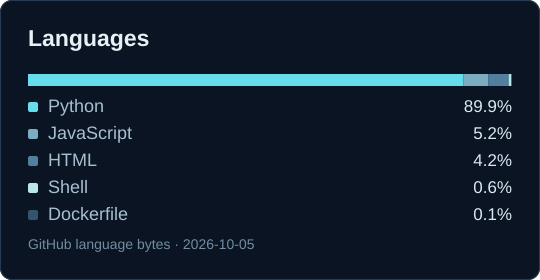
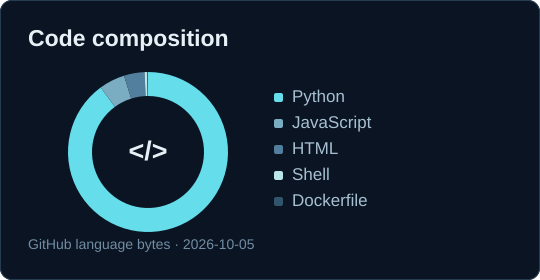
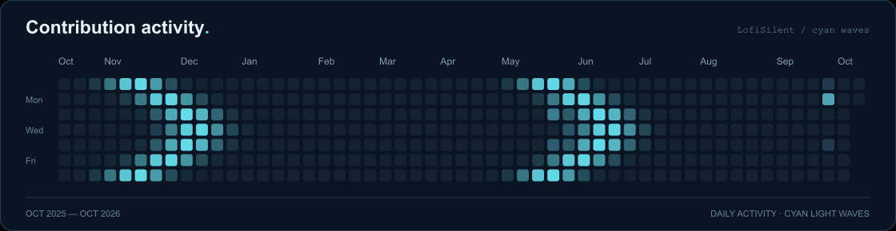

  

### Stack & tools

  
  
  
  
  
  

### Languages

  
  

  

Languages &amp; activity · GitHub snapshot: 2026-10-05

  <a href="https://github.com/LofiSilent">GitHub / LofiSilent</a> &nbsp; · &nbsp; <a href="https://t.me/LoFiSilent">Telegram / LoFiSilent</a>

